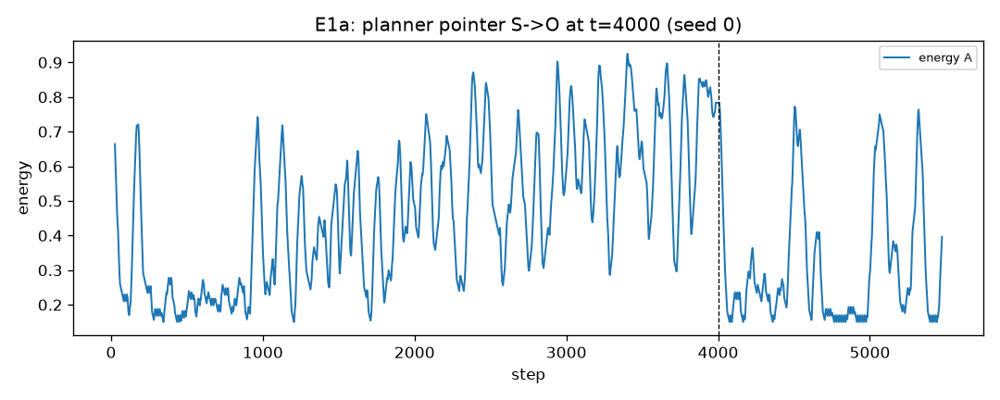
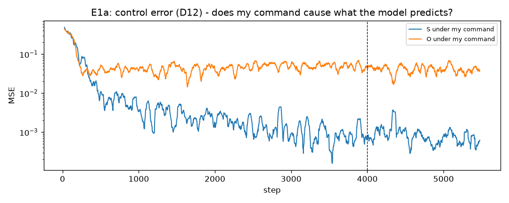
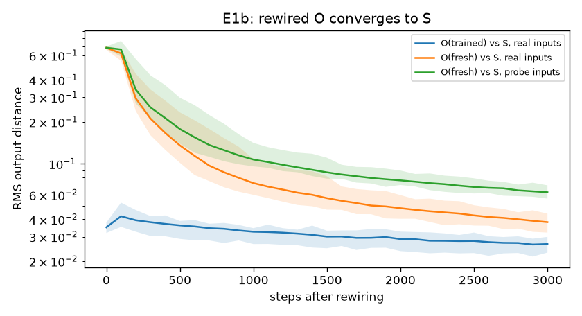

# Результаты прогонов

По каждому прогону: что запускали, числа, графики, вывод, оговорки. Нумерация R1, R2, ...
Все прогоны воспроизводимы: `run_all.py --stages <stage> --out results`. Базовый конфиг — `config.py`
(тор 16×16, окно 5×5, 4000 шагов, см. `decisions.md` D7). Сырые результаты в `results/` (не в git),
графики скопированы в `figures/`.

## R1. Тест на симметричность проводки (2026-09-06)

**Что.** 20 seed'ов с обычной проводкой и 20 с перевёрнутой (`wiring.swapped`), агент A. Код не менялся.

| | обычная | перевёрнутая |
|---|---|---|
| кто водит планировщик | S | O |
| энергия A, последняя четверть | 0.619 | 0.617 |
| ошибка на потоке «я»: S | 0.00078 | 0.00124 |
| ошибка на потоке «я»: O | 0.00126 | 0.00079 |
| KS-тест энергии, p | 0.34 | |

**Вывод: прошёл.** Роли переехали вместе с конфигом: «O» водит планировщик и точно предсказывает своё
состояние, эффективность не изменилась. В коде нет скрытой привязки к именам. Заодно подтверждено I3:
каждая модель на чужом потоке ошибается в ~1.6 раза сильнее, чем на своём, в обеих проводках.

## R2. E1 — самомодель как неподвижная точка проводки (2026-09-06)

10 seed'ов. Обучение 4000 шагов, затем E1a 1500 шагов и E1b 3000 шагов от одной и той же обученной копии.
Числа — средние по seed'ам за последнюю тысячу шагов «до» и «после».

### E1a. Смена указателя (`set_driver("O")`, провода не тронуты)

| | до | после |
|---|---|---|
| энергия A | 0.62 | 0.30 |
| смертей A на 1000 шагов | 6.7 | 35.4 (случайный агент: ~42) |
| энергия B (контроль) | 0.64 | 0.68 |
| ошибка S на потоке «я» | 0.00080 | 0.00065 |
| ошибка O на потоке «я» | 0.00133 | 0.00081 |
| ошибка управления S (D12) | 0.00080 | 0.00065 |
| ошибка управления O (D12) | 0.050 | 0.043 |

Падение энергии у всех 10 seed'ов, минимум 0.16, среднее 0.32.

**Вывод: прошёл.** A ходит хорошим планом для чужого тела и живёт почти как случайный агент. S не перестала
быть самомоделью, O ею не стала (по-прежнему хуже S на потоке «я» и учится только на чужом потоке).
Указатель планировщика — не «я».

**Оговорка 1.** Ожидалось «O не улучшается», а её ошибка на потоке «я» упала на 40% (у S — на 19%).
Разрыв сузился с 1.66× до 1.24×. Гипотеза: под чужим планом траектория A перестаёт зависеть от еды
вокруг A и становится одинаково «чужой» для обеих моделей — S теряет домашнее преимущество (I3),
а не O приобретает. Проверить отдельно (см. `plan.md`).

**Наблюдение (I9, D12).** Ошибка управления — предсказание модели по *моей* команде против факта на её потоке —
различает S и O в 60 раз (0.0008 против 0.05) и **не меняется при переключении указателя**. Это сигнал
о проводке, а не об указателе: он всегда говорит, какая модель сцеплена с моей командой. Ни один
из обычных замеров ошибок при переключении не вырос — внутри системы нет сигнала, что план управляет
не тем телом; есть только исход (энергия). Отсюда: без ошибки управления E4c может учиться только
по выживанию; с ней самообнаружение тривиально. Поэтому E4c и E4c-штрих (D12).

### E1b. Перепроводка (`rewire("O", input=target="internal_state")`, буфер O очищен)

Расстояние RMS между выходами O и S на одних входах, старт → через 3000 шагов:

| | старт | 3000 шагов |
|---|---|---|
| обученная O, реальные входы (из буфера S) | 0.035 | 0.027 |
| свежая O (веса заново), реальные входы | 0.68 | 0.040 |
| свежая O, пробный набор | 0.68 | 0.065 |
| для сравнения: S агента A против S агента B, проба | 0.060 | |
| масштаб шума: корень из ошибки S | 0.019 | |

**Вывод: прошёл, с оговоркой о критерии.** Свежая O за 3000 шагов доходит до расстояния, на котором две
независимые самомодели разных агентов находятся друг от друга (0.065 против 0.060), кривая ещё идёт вниз.
До нуля не доходит; «в пределах шума» — примерно 1.5–2 масштаба ошибки предсказания.

**Наблюдение.** Обученная O была близка к S ещё до перепроводки (0.035, уровень шума). Перепроводка
лишь чуть сдвинула её. Это то, что предсказывает E2: по содержимому S и O почти одинаковы, потому что
физика у обоих агентов одна. Вариант «обученная O» в E1b почти вырожден; настоящую сходимость показывает
только свежая O.
