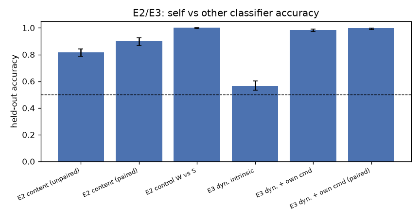
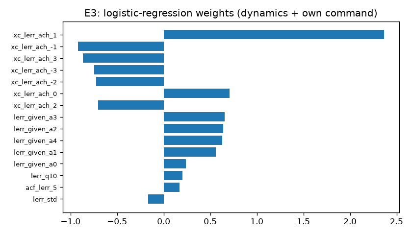
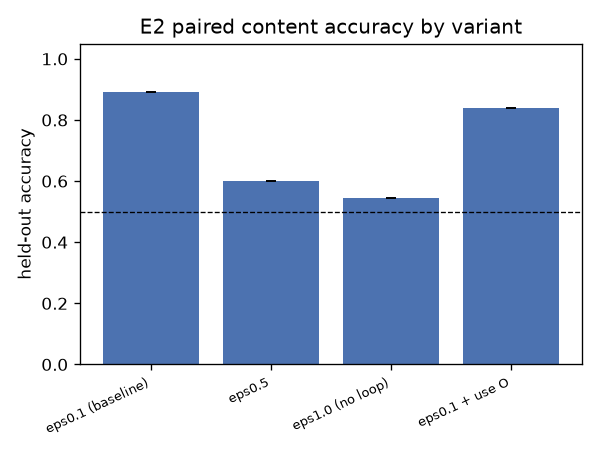

# Результаты прогонов

По каждому прогону: что запускали, числа, графики, вывод, оговорки. Нумерация R1, R2, ...
Все прогоны воспроизводимы: `run_all.py --stages <stage> --out results`. Базовый конфиг — `config.py`
(тор 16×16, окно 5×5, 4000 шагов, см. `decisions.md` D7). Сырые результаты в `results/` (не в git),
графики скопированы в `figures/`.

## R1. Тест на симметричность проводки (2026-09-06)

**Что.** 20 seed'ов с обычной проводкой и 20 с перевёрнутой (`wiring.swapped`), агент A. Код не менялся.

| | обычная | перевёрнутая |
|---|---|---|
| кто водит планировщик | S | O |
| энергия A, последняя четверть | 0.619 | 0.617 |
| ошибка на потоке «я»: S | 0.00078 | 0.00124 |
| ошибка на потоке «я»: O | 0.00126 | 0.00079 |
| KS-тест энергии, p | 0.34 | |

**Вывод: прошёл.** Роли переехали вместе с конфигом: «O» водит планировщик и точно предсказывает своё
состояние, эффективность не изменилась. В коде нет скрытой привязки к именам. Заодно подтверждено I3:
каждая модель на чужом потоке ошибается в ~1.6 раза сильнее, чем на своём, в обеих проводках.

## R2. E1 — самомодель как неподвижная точка проводки (2026-09-06)

10 seed'ов. Обучение 4000 шагов, затем E1a 1500 шагов и E1b 3000 шагов от одной и той же обученной копии.
Числа — средние по seed'ам за последнюю тысячу шагов «до» и «после».

### E1a. Смена указателя (`set_driver("O")`, провода не тронуты)

| | до | после |
|---|---|---|
| энергия A | 0.62 | 0.30 |
| смертей A на 1000 шагов | 6.7 | 35.4 (случайный агент: ~42) |
| энергия B (контроль) | 0.64 | 0.68 |
| ошибка S на потоке «я» | 0.00080 | 0.00065 |
| ошибка O на потоке «я» | 0.00133 | 0.00081 |
| ошибка управления S (D12) | 0.00080 | 0.00065 |
| ошибка управления O (D12) | 0.050 | 0.043 |

Падение энергии у всех 10 seed'ов, минимум 0.16, среднее 0.32.

**Вывод: прошёл.** A ходит хорошим планом для чужого тела и живёт почти как случайный агент. S не перестала
быть самомоделью, O ею не стала (по-прежнему хуже S на потоке «я» и учится только на чужом потоке).
Указатель планировщика — не «я».

**Оговорка 1.** Ожидалось «O не улучшается», а её ошибка на потоке «я» упала на 40% (у S — на 19%).
Разрыв сузился с 1.66× до 1.24×. Гипотеза: под чужим планом траектория A перестаёт зависеть от еды
вокруг A и становится одинаково «чужой» для обеих моделей — S теряет домашнее преимущество (I3),
а не O приобретает. Проверить отдельно (см. `plan.md`).

**Наблюдение (I9, D12).** Ошибка управления — предсказание модели по *моей* команде против факта на её потоке —
различает S и O в 60 раз (0.0008 против 0.05) и **не меняется при переключении указателя**. Это сигнал
о проводке, а не об указателе: он всегда говорит, какая модель сцеплена с моей командой. Ни один
из обычных замеров ошибок при переключении не вырос — внутри системы нет сигнала, что план управляет
не тем телом; есть только исход (энергия). Отсюда: без ошибки управления E4c может учиться только
по выживанию; с ней самообнаружение тривиально. Поэтому E4c и E4c-штрих (D12).

### E1b. Перепроводка (`rewire("O", input=target="internal_state")`, буфер O очищен)

Расстояние RMS между выходами O и S на одних входах, старт → через 3000 шагов:

| | старт | 3000 шагов |
|---|---|---|
| обученная O, реальные входы (из буфера S) | 0.035 | 0.027 |
| свежая O (веса заново), реальные входы | 0.68 | 0.040 |
| свежая O, пробный набор | 0.68 | 0.065 |
| для сравнения: S агента A против S агента B, проба | 0.060 | |
| масштаб шума: корень из ошибки S | 0.019 | |

**Вывод: прошёл, с оговоркой о критерии.** Свежая O за 3000 шагов доходит до расстояния, на котором две
независимые самомодели разных агентов находятся друг от друга (0.065 против 0.060), кривая ещё идёт вниз.
До нуля не доходит; «в пределах шума» — примерно 1.5–2 масштаба ошибки предсказания.

**Наблюдение.** Обученная O была близка к S ещё до перепроводки (0.035, уровень шума). Перепроводка
лишь чуть сдвинула её. Это то, что предсказывает E2: по содержимому S и O почти одинаковы, потому что
физика у обоих агентов одна. Вариант «обученная O» в E1b почти вырожден; настоящую сходимость показывает
только свежая O.

## R3. E2/E3 — содержимое и динамика (2026-09-06)

200 прогонов (seed 1000–1199), по 4000 шагов, обычная проводка. Из каждого прогона оба агента,
итого 400 пар (S, O) = 800 моделей. Классификаторы: логистическая регрессия и случайный лес,
5-кратная кросс-валидация с группировкой по прогону (модели одного прогона не попадают в обучение
и в тест одновременно). Перестановочный тест: 100 перестановок меток внутри прогонов.
Запуск: `run_all.py --stages e23`, ~18 минут на 15 ядрах плюс минута классификаторов.

### Предпроверки (обе прошли)

**Симметрия A/B** по 200 прогонам, последняя четверть: энергия 0.631 против 0.626 (KS p = 0.92),
ошибка S 0.000796 против 0.000786 (p = 0.33), смертей 6.8 против 7.0 (p = 0.92). Неразличимы.

**Равенство потоков S и O** (102 400 примеров в каждом из буферов): максимальная стандартизованная разница
средних по входам 0.011, по целям 0.005; KS по энергии на входе p = 0.98; частоты действий и плотность еды
совпадают до третьего знака. Потоки одинаковы. Значит, если содержимое различимо — это **не** провал-подделка
в смысле спеки.

### E2. По содержимому — ПРОВАЛ (настоящий)

| признаки | без пар | парный | 
|---|---|---|
| спектры и смещения весов (то же, что в контроле) | 0.496 | |
| + статистики активаций на пробном наборе | 0.535 | |
| + выходы на пробном наборе (функция модели) | **0.818** [0.79, 0.84] | **0.900** [0.87, 0.93] |
| контроль: W против S, спектры и смещения | 1.000 | |

Перестановочный тест: p < 0.01, среднее по перестановкам 0.50 (без пар) / 0.59 (парный).

По весам (спектр, смещения, активации) S и O неразличимы: 0.50–0.53. Различие живёт **только в функции**:
в том, что модели отвечают на одинаковые вопросы. Контроль показывает, что классификатор не слеп.

**Где именно различие** (`tools/e2_diagnose.py`, парная разность S − O на 256 пробных входах × 400 пар):

| выход | средняя разность S − O | t по 400 парам |
|---|---|---|
| позиция (4 числа) | ~0.000 | < 1.7 |
| **энергия** | **−0.0144** | **−20.5** |

Различие целиком в предсказании энергии. S предсказывает энергию систематически **ниже**, чем O, на 0.014
(масштаб: шаг распада 0.02, еда +0.3). Относительно правды: O почти несмещена (0.497 против истинного 0.495
в среднем по пробе), S занижает (0.483). Сдвиг есть во всех группах пробных входов: с едой и без, при любой
энергии, при любом действии; при «стоять» сильнее (−0.020).

**Механизм** (тот, который спека называет «провал настоящий»): планировщик выбирает действие с максимальной
энергией по предсказанию S. Там, где S завышает, A идёт, разочаровывается, и S корректируется вниз.
Там, где S занижает, A не идёт, и S не корректируется. Асимметричная коррекция → систематический
пессимизм самомодели. Это проклятие оптимизатора, просочившееся в веса: модель, чьи предсказания
выбирают её же данные, становится пессимистом. O такого замыкания нет (данные B выбирает S_B, а не O),
и O остаётся несмещённой.

**Вывод.** Контур просачивается в содержимое. П. 4 спеки («граф контура в содержимое не входит») в сильной
форме неверен: интроспектирующий кволег, сравнивая S и O по выходам, найдёт, что одна из моделей
систематически пессимистичнее другой. Но заметь, что это различие — **следствие** привилегии, а не её
объяснение: «одна модель осторожнее» не говорит, почему она управляет. См. `ideas.md` I12.

**Что нужно проверить** (план): epsilon = 1.0 (случайная политика, замыкания нет) — сдвиг должен исчезнуть.
Промежуточные epsilon — сдвиг должен убывать монотонно. Это подтвердит механизм и войдёт в свип D11.

### E3. По динамике — ПРОШЁЛ

| признаки | без пар | парный |
|---|---|---|
| только ряды ошибок и обновлений | 0.568 [0.53, 0.60] (p < 0.01) | 0.610 |
| + копия собственной команды | **0.983** [0.97, 0.99] | **0.998** [0.99, 1.00] |

Без ссылки на команду асимметрия в динамике едва видна (0.57, но значимо выше случайного). С копией
собственной команды — почти идеально. Главные признаки по весам логистической регрессии: кросс-корреляция
логарифма ошибки со сменой моей команды на лагах +1, −1, ±3 (`xc_lerr_ach_*`), затем ошибка при условии
моей команды (`lerr_given_a*`). То есть классификатор нашёл ровно то, что предсказывает теория:
ошибка одной модели сцеплена с моей командой, ошибка другой — нет.

### Три числа

| | ожидание спеки | получено | итог |
|---|---|---|---|
| E1b сходимость | → 0 | 0.04 (уровень двух независимых самомоделей) | прошёл с оговоркой |
| E2 точность по содержимому | ≈ 0.5 | **0.82 / 0.90** (только по функции; по весам 0.50) | **провал, настоящий** |
| E3 точность по динамике | ≈ 1 | 0.98 / 0.998 (с командой), 0.57 без | прошёл |

## R4. Проверка механизма E2: замыкание через действие (2026-09-06)

Четыре варианта по 100 прогонов (базовый — первые 100 из R3). Тот же конвейер E2/E3, плюс парная разность
предсказанной энергии S − O на пробном наборе (200 пар на вариант). Запуск: `run_all.py --stages e2v`, 25 минут.

| вариант | энергия | смертей/1000 | сдвиг S − O | t | E2 без пар | E2 парный | E2 по весам | E3 без команды | E3 с командой |
|---|---|---|---|---|---|---|---|---|---|
| epsilon 0.1 (база) | 0.629 | 6.8 | **−0.0145** | −15.0 | 0.82 | **0.89** | 0.45 | 0.54 | 0.98 |
| epsilon 0.5 | 0.621 | 6.7 | −0.0046 | −4.7 | 0.56 | 0.60 | 0.52 | 0.57 | 0.87 |
| epsilon 1.0 (замыкания нет) | 0.244 | 42.4 | −0.0016 | −2.1 | 0.52 | **0.55** | 0.54 | 0.51 | 0.71 |
| epsilon 0.1 + O в планировании (D13) | 0.633 | 6.7 | −0.0137 | −14.6 | 0.81 | 0.84 | 0.51 | 0.59 | 0.99 |

Потоки и симметрия во всех вариантах в норме.

**Вывод 1: механизм подтверждён.** Чем меньше планировщик слушает S, тем меньше сдвиг и тем хуже различимость:
0.89 → 0.60 → 0.55 при epsilon 0.1 → 0.5 → 1.0. При случайной политике сдвиг исчезает (−0.0016, t = −2,
на грани значимости) и E2 даёт ожидаемые спекой 0.5. Различие по содержимому целиком порождено замыканием
«предсказания S выбирают данные S». Без замыкания S и O — одна и та же функция.

**Вывод 2: польза O картину не меняет.** Когда планировщик учитывает O (не идёт за едой, которую займёт B),
сдвиг S тот же (−0.0137), E2 тот же (0.84). O стала влиять на действия A, но её данные по-прежнему выбирает
не она, а B своей самомоделью. Замыкание «мои предсказания выбирают мои данные» у O не появилось, и следа
в ней нет. Это подтверждает I11: для различия «кто я» важна не польза модели, а то, чьи данные она выбирает.
Заодно: с учётом O выживаемость чуть лучше (0.633 против 0.629), но в пределах шума.

**Наблюдение по E3.** Различимость по динамике с копией команды тоже падает с ростом epsilon: 0.98 → 0.87 → 0.71.
При epsilon 1.0 моя команда случайна, но S всё равно сцеплена с ней (ошибка S зависит от того, что я скомандовал),
поэтому 0.71, а не 0.5. Динамическая асимметрия частично живёт в замыкании (планировщик), частично
в самой проводке (команда → моё состояние). Второе остаётся и без планировщика.

**Итог для теории.** Пункт 4 неверен в сильной форме ровно в той мере, в какой система действует по своей
самомодели. Пассивная система (epsilon 1) — модели неразличимы. Действующая система — самомодель пессимист.
След в содержимом есть только у того, кто действует, и он вызван действием. См. `ideas.md` I12, I13.
